# *Plasmodium falciparum* Antimalarial Drug-Resistance Surveillance Pipeline

A Nanopore amplicon-sequencing pipeline that takes barcoded MinION reads of *P. falciparum*
drug-resistance genes, calls variants against the PlasmoDB 3D7 reference, translates them with
strand- and intron-aware consequence calling, and scores the results against the **WHO Compendium
of molecular markers for antimalarial drug resistance** to produce a per-sample resistance report.

---

## What it does

For each barcode (sample), the pipeline:

1. Combines and length-filters the raw FASTQ reads.
2. Runs quality control (read-length/quality summary).
3. Trims sequencing adapters.
4. Aligns to the whole *P. falciparum* 3D7 genome.
5. Measures per-gene coverage at the target loci.
6. Calls variants with Clair3, restricted to the resistance-gene targets.
7. Normalises and quality-filters the variants.
8. Annotates amino-acid consequences with `bcftools csq` (using the genome annotation, so
   multi-exon and minus-strand genes are translated correctly).
9. Matches the observed amino-acid changes against the WHO marker catalogue and writes the
   final resistance calls, a full variant detail table, and a coverage report.

A central methodological choice is that variants are called and annotated against the **complete
3D7 genome together with its GFF3 annotation**. Supplying the full genome and annotation lets
`bcftools csq` resolve each gene's exon/intron structure, coding strand, and UTRs when it translates
a variant into an amino-acid change. This is required for correct translation of multi-exon and
minus-strand genes such as *crt*, *dhps*, and *cytb*: their coding sequence is not a contiguous
slice of the contig, so the genomic position of a codon can only be determined from the annotated
CDS structure, and the amino-acid consequence depends on strand. Variant calling is then restricted
to the resistance-gene targets through a BED file, which focuses the computation while preserving
genome-wide, annotation-aware translation.

---

## Desktop app (zero-setup GUI)

A self-contained desktop app (`gui/`) wraps the pipeline so a non-technical
user can add analysis jobs, watch progress, and browse a results dashboard
without installing anything. It is a layer on top of the same bash pipeline
(`bin/pf-drug-resistance-pipeline.sh`) and `src/generate_report.py` — those
run unchanged.

### Using the app

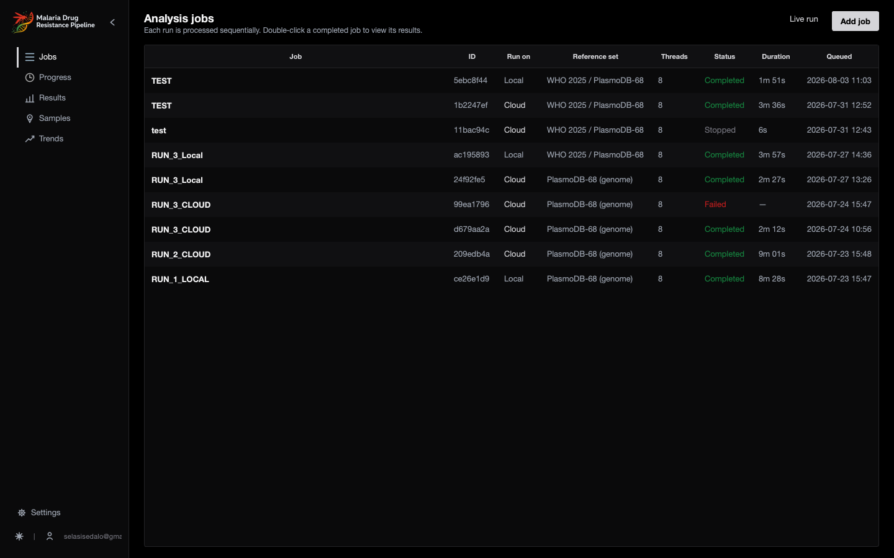

1. **Open it** — double-click `PfDrugResistance.app` (macOS) or run the Linux
   `AppRun`/AppImage. The bundle ships the whole bioinformatics environment
   (Clair3, minimap2, samtools, bcftools, bedtools), the Clair3 model and the
   reference data, so the first launch is fully offline with no conda required.
2. **Add a job** — *Jobs → + Add Job*. Browse to a FASTQ directory (containing
   `barcode*/` subdirs) and an output directory, pick a reference set, and set
   Threads / Min QUAL / Min DP / Min MAPQ. *Load Previous Configuration* reuses
   a saved config. Adding enqueues the job.

   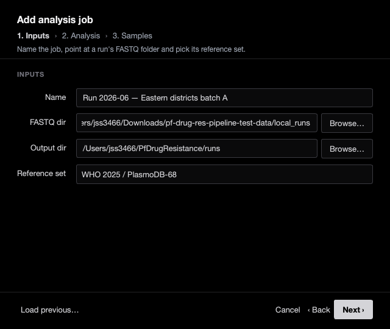
3. **Watch progress** — the Progress screen shows the canonical steps
   (QC → Trim → QC → Align → Coverage → Variant calling → Filter → Combine →
   Report), a live log, elapsed time, current sample and CPU/RAM/Disk gauges.
   Multiple jobs run **one at a time, sequentially**. *Stop / View Logs /
   Open Output* are available.

   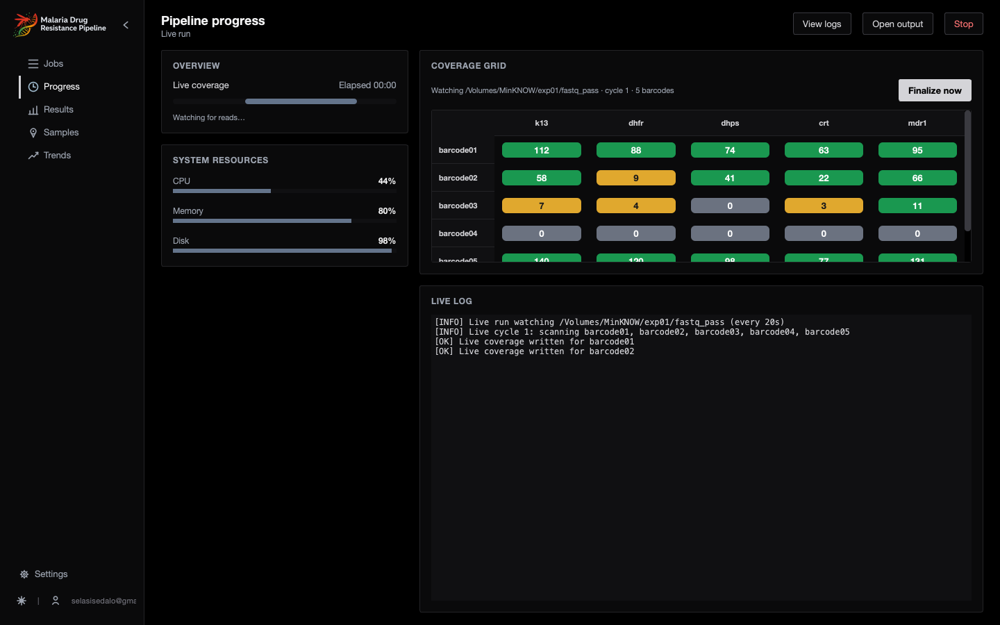
4. **View results** — on completion the Dashboard loads the three CSVs from
   `output_dir/final_reports`: summary cards, tabs (Drug Resistance Summary,
   Gene Summary, Mutations, Quality Metrics, Sample Comparison), a donut + bar
   chart, and **Export CSV / Excel / PDF / Open Folder**. The color language
   matches the PDF report.

   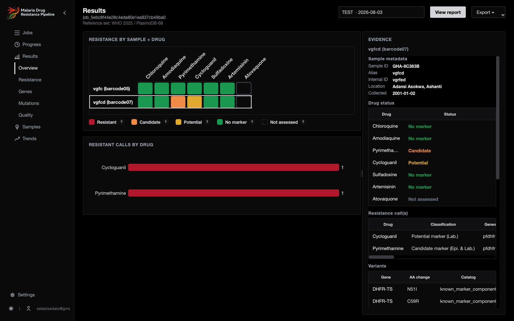

<details>
<summary><b>More screens</b> (results tabs, history, report settings, sign-in, light theme)</summary>

| | |
|---|---|
| Drug resistance | 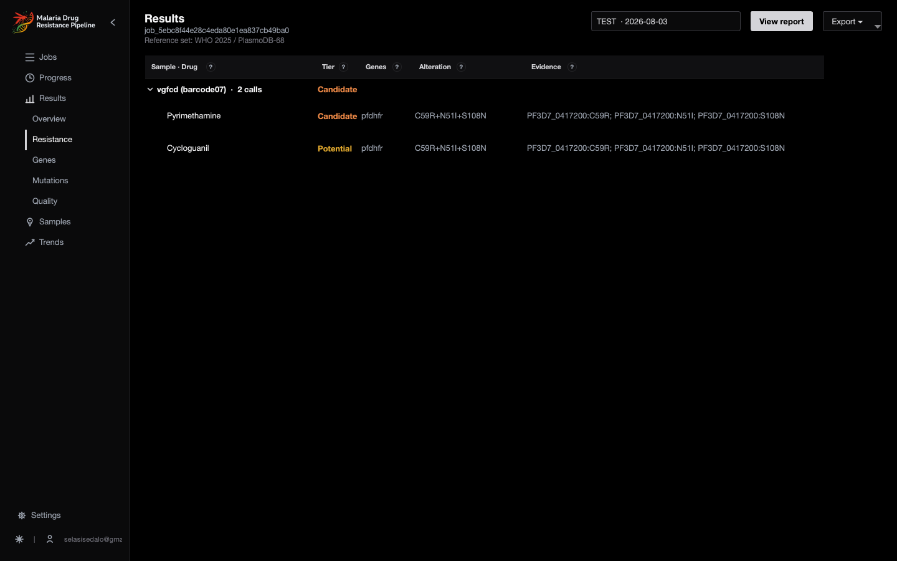 |
| Gene summary | 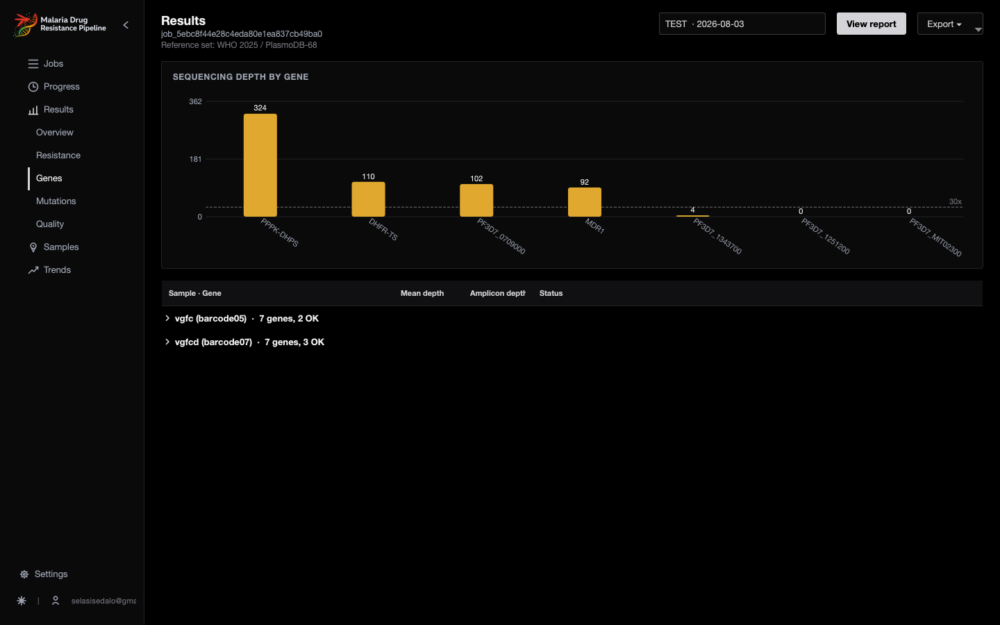 |
| Mutations | 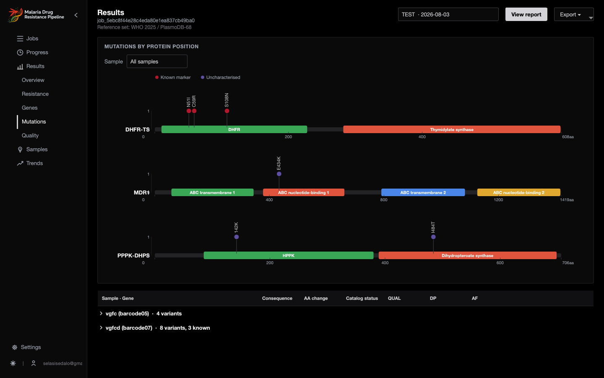 |
| Quality metrics | 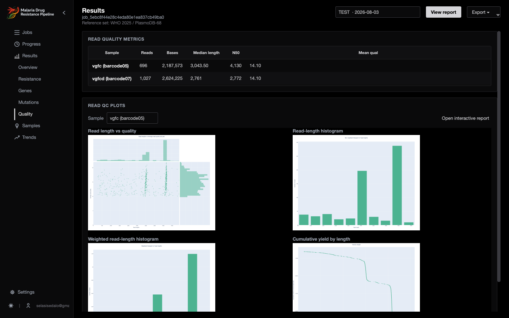 |
| History / trends | 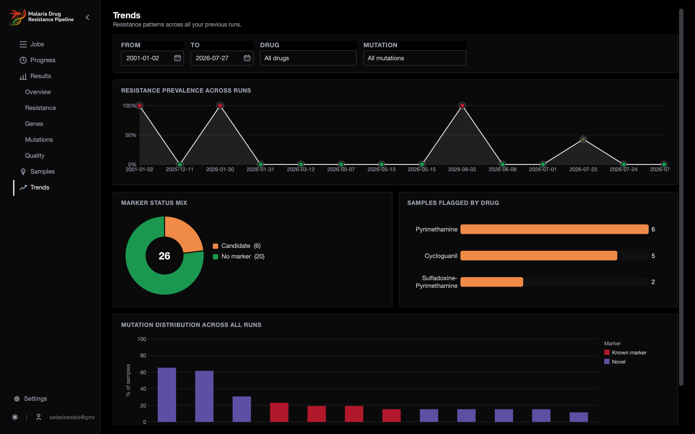 |
| Report settings | 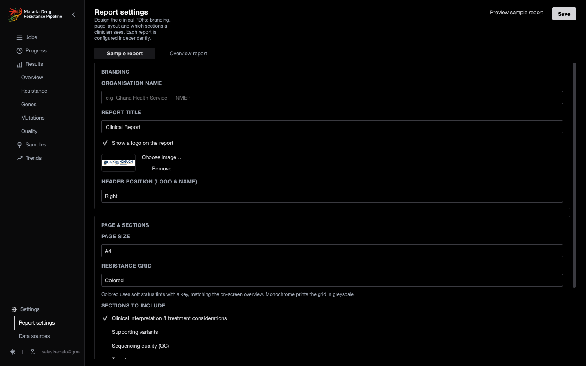 |
| Data sources | 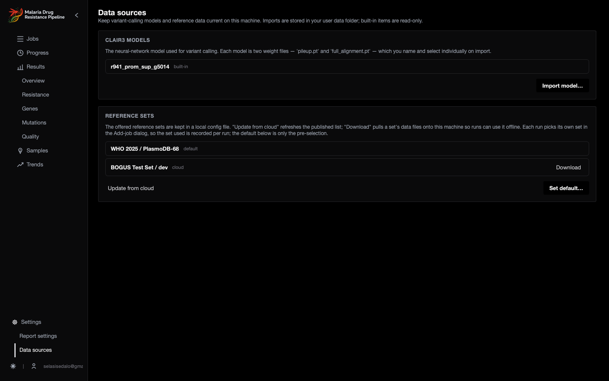 |
| Sign-in | 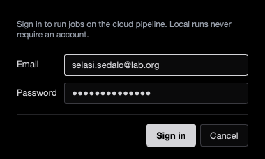 |
| Light theme | 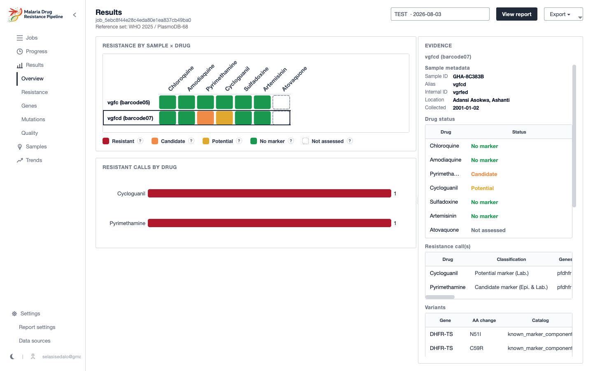 |

</details>

### Persistence
Jobs, saved configurations and run history are stored in a SQLite database in
the per-user data directory (it survives the read-only bundle and macOS
app-translocation):

- macOS: `~/Library/Application Support/PfDrugResistance/`
- Linux: `$XDG_DATA_HOME/PfDrugResistance/` (default `~/.local/share/PfDrugResistance/`)

This directory also holds default job outputs (`runs/`), per-run configs
(`configs/`) and logs (`logs/`). Quitting and relaunching reloads everything,
and any past completed run can be reopened in the dashboard.

### Running from source (development)
Install the GUI deps into the `nanopore_all` env (already added to
`envs/install_pipeline_dependencies.sh`: `pyqt`, `psutil`, `openpyxl`,
`matplotlib`, `conda-pack`), then:

```bash
conda activate nanopore_all
python -m gui.app
```

### Building the bundle
```bash
# macOS: produces build/PfDrugResistance.app (set MAKE_DMG=1 to also wrap a .dmg)
bash package/build_macos_app.sh

# Linux: produces build/PfDrugResistance.AppDir (+ AppImage if appimagetool is present)
bash package/build_linux.sh
```

Both scripts `conda pack` the `nanopore_all` env into the bundle, copy the app
code + refs + Clair3 model, and write a launcher that sets `PATH`/`PYTHONPATH`
to the bundled env before running `python -m gui.app`. **The resulting bundle
is large (multiple GB)** because it ships native bio tools, the Clair3 PyTorch
model and the *P. falciparum* reference.

---

## Target genes and drugs

| Gene symbol | PlasmoDB gene ID | Reference contig | Associated drug class |
|-------------|------------------|------------------|-----------------------|
| pfdhfr      | PF3D7_0417200    | Pf3D7_04_v3      | Pyrimethamine / Cycloguanil (antifolates) |
| pfdhps      | PF3D7_0810800    | Pf3D7_08_v3      | Sulfadoxine (antifolates) |
| pfmdr1      | PF3D7_0523000    | Pf3D7_05_v3      | Chloroquine / Amodiaquine / partner drugs |
| pfcrt       | PF3D7_0709000    | Pf3D7_07_v3      | Chloroquine |
| pfk13       | PF3D7_1343700    | Pf3D7_13_v3      | Artemisinins |
| pfcytb      | PF3D7_MIT02300   | Pf3D7_MIT_v3     | Atovaquone |
| pfcoronin   | PF3D7_1251200    | Pf3D7_12_v3      | Artemisinin (candidate) |

The SNP target genes are derived automatically from the WHO compendium (the target BED and marker
catalogue ship pre-built with the repo — see *Reference data*). Amplification-only markers
(e.g. *gch1*, *pm2*, *pm3* copy-number) are intentionally excluded, since copy number is not callable
from this SNP workflow.

> **Scope — which genes are actually assessed.** The pipeline reports on whichever target genes your
> amplicon panel amplifies. Amplification is a wet-lab step you control: only loci covered by your
> panel's primers receive reads, so only those can be genotyped. The per-gene `coverage_report.csv`
> makes this explicit — a target with no reads is reported as `NO_COVERAGE`, meaning "not assessed",
> **not** "wild-type / sensitive". Before relying on a run, confirm your panel amplifies every gene you
> intend to surveil; a target that is consistently `NO_COVERAGE` across all samples indicates its
> primers are absent from the panel or not working, and either the panel or the target list should be
> adjusted to match.

---

## Requirements

### Platform
- macOS (developed on Apple Silicon, arm64) or Linux.
- Clair3 is installed natively from bioconda (no Docker required).

### Conda environment (`nanopore_all`)
Setup is one command:

```bash
bash envs/install_pipeline_dependencies.sh
```

It creates the `nanopore_all` environment with the full toolchain (minimap2, samtools, bcftools,
bedtools, porechop_abi, NanoStat/NanoPlot, and the Python dependencies). Activate it before running:
`conda activate nanopore_all`.

### Clair3
Clair3 is installed natively via conda (`bioconda::clair3`) by the setup script — no Docker required.
The variant-calling model `r941_prom_sup_g5014` (R9.4.1 chemistry) lives under `data/clair3_models/`
and is selected via `CLAIR3_MODEL`; the setup script downloads it if it is missing.

> **Critical:** the Clair3 model must match your flowcell chemistry. `r941_*` is for R9.4.1
> (FLO-MIN106). If you sequence on R10.4.1 (FLO-MIN114), switch to an `r1041_*` model, or every
> call is made by a mismatched model.

---

## Reference data

All reference inputs live under `data/external/pf-ref/`:

| File | Description |
|------|-------------|
| `genome/PlasmoDB-68_Pfalciparum3D7_Genome.fasta` | Whole 3D7 genome, PlasmoDB release 68 (16 contigs: 14 chromosomes + apicoplast + mitochondrion, ~23.3 Mb) |
| `annotation/PlasmoDB-68_Pfalciparum3D7.gff` | Matching GFF3 annotation (genes, exons, CDS, UTRs) |
| `compendium-of-molecular-markers-for-antimalarial-drug-resistance.csv` | The WHO marker compendium |

The genome and GFF ship with the repository (PlasmoDB release 68), so a clone is ready to run without
a separate download. They come from the same release, which keeps gene IDs and coordinates consistent;
if you ever replace them, keep the genome and GFF on a matching PlasmoDB release. The `.fasta.fai`
index is rebuilt automatically on first run.

---

## Repository layout

```
malaria_drug_resistance_pipeline/
├── bin/
│   └── pf-drug-resistance-pipeline.sh     # main orchestrator
├── config/
│   └── pipeline.conf                      # all tunable parameters
├── envs/
│   └── install_pipeline_dependencies.sh   # conda environment setup
├── src/
│   ├── combine_haplotype.py               # consequence reports + catalogue -> resistance calls
│   ├── generate_report.py                 # resistance calls -> PDF report
│   └── write_manifest.py                  # run status + provenance -> manifest.json
├── data/
│   ├── external/pf-ref/                   # genome, GFF, compendium CSV (see Reference data)
│   ├── clair3_models/
│   │   └── r941_prom_sup_g5014/           # local Clair3 model
│   ├── fastq_pass/                        # input reads, one folder per barcode
│   │   ├── barcode01/  *.fastq(.gz)
│   │   ├── barcode02/
│   │   └── ...
│   └── interim/
│       ├── targets/  pf_snp_targets.PlasmoDB-68.bed (+ .report.tsv)
│       └── catalog/  pf_resistance_catalog.PlasmoDB-68.tsv
├── results/
│   └── analysis_output/                   # all outputs (see Outputs)
└── README.md
```

---

## Reference data is pre-built

The target BED (`data/interim/targets/pf_snp_targets.PlasmoDB-68.bed`) and the resistance catalogue
(`data/interim/catalog/pf_resistance_catalog.PlasmoDB-68.tsv`) **ship pre-built** with the repository,
so a clone is ready to run — there is no build step to perform.

These artifacts are only regenerated when the WHO compendium or the PlasmoDB release changes. That is a
development-time task handled by the standalone **reference-builders** toolkit (`build_targets.py`
resolves marker genes to genome coordinates via the GFF; `build_catalog.py` flattens the compendium
into one row per marker component). The toolkit is kept **outside this repo** because the pipeline never
invokes it at runtime; its README documents the two-stage build and the exact inputs/outputs.

---

## Configuration (`config/pipeline.conf`)

Key parameters:

| Parameter | Meaning |
|-----------|---------|
| `REFERENCE` | Path to the genome FASTA |
| `ANNOTATION_GFF` | Path to the GFF3 |
| `ORIGINAL_BED_FILE` | Generated target BED |
| `RESISTANCE_CATALOG` | Generated catalogue TSV |
| `FASTQ_PASS_DIR` | Directory of `barcode*/` input folders |
| `OUTPUT_DIR` | Where results are written |
| `THREADS` | CPU threads |
| `MIN_READ_LENGTH` / `MAX_READ_LENGTH` | Read-length filter bounds (e.g. 300 / 5000) |
| `MIN_QUAL` | Minimum variant QUAL for the bcftools filter |
| `MIN_DP` | Minimum depth for the bcftools filter and the coverage gate (e.g. 10) |
| `MIN_MQ` / `MIN_COVERAGE` | Clair3 mapping-quality and coverage minimums |
| `CHUNK_SIZE` | Clair3 chunk size — keep large (e.g. 5000000) so each contig is one chunk |
| `CLAIR3_MODEL` | Clair3 model directory under `data/clair3_models/` (must match flowcell chemistry) |
| `QC_TOOL` | `nanostat` (fast, stats only) or `nanoplot` (full plots) |
| `RUN_PRETRIM_QC` | `true`/`false` — run the pre-trim QC pass |
| `REPORT_MODE` | PDF report mode: `combined` (default), `per-sample`, `both`, or `none`/`off`/`skip` to skip the PDF and emit only the CSVs |

> `CHUNK_SIZE` matters for speed: small values shatter each chromosome into hundreds of chunks and
> the run crawls. A value above the largest contig length makes each contig a single chunk.

---

## Input data

Standard Nanopore demultiplexed output: one folder per barcode under `FASTQ_PASS_DIR`
(`data/fastq_pass/` by default), each containing one or more `.fastq` or `.fastq.gz` files.

```
data/fastq_pass/
├── barcode01/  reads.fastq.gz
├── barcode02/  reads.fastq.gz
└── ...
```

---

## Running

```bash
conda activate nanopore_all
bash bin/pf-drug-resistance-pipeline.sh
```

The script initialises (validates the genome, BED, GFF; builds/refreshes the `.fai`; checks that
native Clair3 is on PATH), prepares the BED, processes every barcode, and finally combines the
per-sample outputs.

**CSV-only (headless, no PDF).** The CSVs are always produced; the PDF is the only optional stage.
To run purely on the command line and stop at the CSVs, set `REPORT_MODE=none`:

```bash
REPORT_MODE=none bash bin/pf-drug-resistance-pipeline.sh
```

This skips Step 10 entirely and never touches `gui/` — useful for servers, batch jobs, or piping the
CSVs into downstream analysis.

### What each step does

| Step | Action | Tool |
|------|--------|------|
| 1 | Combine + length-filter FASTQs | shell / awk |
| 2 | Pre-trim QC (optional) | NanoStat / NanoPlot |
| 3 | Adapter trimming | porechop_abi |
| 4 | Post-trim QC | NanoStat / NanoPlot |
| 5 | Align, sort, and index in one stream — minimap2 piped into samtools sort, writing only the sorted BAM (no intermediate SAM/unsorted BAM) | minimap2, samtools |
| 5b | Per-gene coverage over targets | samtools depth |
| 6 | Variant calling (BED-restricted) | Clair3 (native conda) |
| 7 | Region-restrict, normalise, quality/depth filter | bcftools view/norm |
| 8 | Consequence annotation (HGVS, strand/intron-aware) | bcftools csq |
| 9 | Combine reports, match catalogue, write final outputs | combine_haplotype.py |
| 10 | Render the color-coded PDF report from the final CSVs | generate_report.py |

Step 10 reads the three CSVs from Step 9 and writes a polished PDF. It is decoupled from CSV
generation and **does not hard-fail the run** — if only the PDF step fails, the CSVs are still
available. The report mode is set by `REPORT_MODE` in the config (see below).

---

## Outputs (`results/analysis_output/`)

| Path | Contents |
|------|----------|
| `final_reports/resistance_calls.csv` | One row per matched WHO marker: Sample, Drug, Classification, Genes, Alteration, Evidence |
| `final_reports/variant_detail.csv` | Every coding change, flagged `known_marker_component` / `uncharacterized` (or blank for non-coding) |
| `final_reports/coverage_report.csv` | Per-sample, per-gene: whole-gene mean depth, amplicon depth, and coverage status |
| `final_reports/resistance_report.pdf` | Color-coded combined PDF report (drug × sample matrix, read-level + coverage QC tables, per-sample drug-status panels and variant tables) — written when `REPORT_MODE` is `combined` or `both` |
| `final_reports/report_<barcode>.pdf` | Per-sample PDF — written when `REPORT_MODE` is `per-sample` or `both` |
| `reports/<barcode>_haplotypes.txt` | Per-barcode consequence table (csq output) |
| `reports/<barcode>_coverage.tsv` | Per-barcode coverage |
| `aligned/`, `clair3/`, `variants/`, `trimmed/`, `qc_*/` | Intermediates |

**Example `resistance_calls.csv`** (one row per matched WHO marker per sample):

```csv
Sample,Drug,Classification,Genes,Alteration,Evidence
barcode07,Pyrimethamine,Candidate marker (Epi. & Lab.),pfdhfr,C59R+N51I+S108N,PF3D7_0417200:C59R; PF3D7_0417200:N51I; PF3D7_0417200:S108N
barcode08,Sulfadoxine-Pyrimethamine,Candidate marker (Epi. & Lab.),"pfdhfr,pfdhps",C59R+S108N & S436A,PF3D7_0417200:C59R; PF3D7_0417200:S108N; PF3D7_0810800:S436A
barcode09,Pyrimethamine,Candidate marker (Epi. & Lab.),pfdhfr,S108N,PF3D7_0417200:S108N
```

A haplotype marker (e.g. `C59R+N51I+S108N`) is only called when **all** its components are present;
cross-gene markers (`&`) list every gene in `Genes` and every component in `Evidence`.

### Interpreting the results

**`resistance_calls.csv`** — with `--collapse` (the default in Step 9), only the *maximal* genotype
per drug is reported, so a triple mutant appears once rather than as every sub-combination.
Classifications carry the WHO evidence tier (Validated / Candidate / Potential). Cross-gene markers
(e.g. SP requiring both *dhfr* and *dhps* components) are only called when both genes are satisfied.

**`variant_detail.csv`** — the audit trail. `known_marker_component` means the change is part of a
catalogue marker (possibly insufficient alone); `uncharacterized` means a coding change not in the
compendium (surfaced, not dropped — useful for novel variants).

**`coverage_report.csv`** — read this *alongside* the calls. `Amplicon_Depth` is the mean depth over
the bases that actually carried reads (the amplicon footprint), so it is independent of gene size.
Status is `OK`, `LOW_COVERAGE`, or `NO_COVERAGE`. **A gene with `NO_COVERAGE` cannot be assessed — its
absence from the calls means "not seen", not "wild-type / sensitive".** This is the difference between
"no atovaquone resistance" and "atovaquone could not be evaluated".

---

## PDF report

Alongside the three CSVs, the pipeline renders a **color-coded PDF report** designed to be read by
both clinicians and researchers (Step 10, `src/generate_report.py`). The CSVs remain the
authoritative, machine-readable output; the PDF is an interpretive layer on top of them.

### Report mode

`REPORT_MODE` in `config/pipeline.conf` (or `--mode` on the standalone script) controls what is
produced:

| Mode | Output |
|------|--------|
| `combined` (default) | `final_reports/resistance_report.pdf` — every sample in one document |
| `per-sample` | `final_reports/report_<barcode>.pdf` — one file per sample |
| `both` | both of the above |

The report is built around a **drug-status panel**: every drug in the panel is shown for every
sample with one of five verdicts, so "checked and clear" is never confused with "not looked at":

| Verdict | Meaning |
|---------|---------|
| **Resistant** | a validated WHO marker was called |
| **Candidate** | a candidate-tier marker was called |
| **Potential** | a potential-tier marker was called |
| **No marker detected** | the informing gene was sequenced and no marker was found (reassuring) |
| **Not assessed** | the informing gene had no coverage, so the drug could not be evaluated |

This is the distinction the whole pipeline exists to make: a drug with no call is only reassuring if
its gene was actually sequenced (e.g. here Artemisinin / *pfk13* reads `No marker detected`, while
Atovaquone / *pfcytb* reads `Not assessed` because that amplicon produced no reads).

The combined report contains: a title band, the color legend, a one-line run summary, a **drug ×
sample overview matrix** (full panel, the five verdicts), a **Quality control** section, and a
**per-sample detail** block (the drug-status panel with the driving mutation, plus a captioned
supporting-variant table showing every coding change, allele frequency, depth, and known-marker /
novel status). Genes are shown by their familiar symbols (*pfdhfr*, *pfmdr1*, *pfcrt*, *pfdhps*,
*pfk13*, *pfcytb*, *pfcoronin*) rather than raw PlasmoDB IDs.

The **Quality control** section has two tables:

- **Sequencing quality (after trimming)** — read-level metrics per sample (reads, yield in Mb,
  median read length, N50, mean Q), read from the NanoStat reports in `qc_trimmed/`. The report
  looks for `<qc_dir>/<barcode>/<barcode>_nanostat.txt`; `--qc_dir` defaults to a `qc_trimmed`
  sibling of `--reports_dir` and the table is skipped gracefully if those files are absent.
- **Target gene coverage** — per-gene amplicon coverage status (OK / Low / grey "not assessed"),
  the basis for the `Not assessed` verdict above.

### The color language

The report uses one consistent palette throughout, so the colors mean the same thing on every page:

| Color | Meaning |
|-------|---------|
| Deep red | Resistant — validated WHO marker (strongest concern) |
| Orange | Candidate marker |
| Yellow | Potential marker |
| Green | No marker detected / coverage OK (good, clear) |
| **Grey** | **Not assessed — the gene had no coverage (NOT wild-type)** |
| Purple | Uncharacterized / novel variant |

The grey "not assessed" state is the key scientific point: a `NO_COVERAGE` gene is shown grey, never
green, because its absence from the calls means "not seen", not "sensitive".

### Re-running the report on its own

Because the report only consumes the three final CSVs, it can be regenerated without re-running the
heavy pipeline:

```bash
python3 src/generate_report.py \
    --reports_dir results/analysis_output/final_reports \
    --output_dir  results/analysis_output/final_reports \
    --mode combined            # combined | per-sample | both
# optional: --run-name "Field run 2025-06 (Site A)"
# optional: --qc_dir results/analysis_output/qc_trimmed   (auto-detected by default)
```

Requires `reportlab` (added by `envs/install_pipeline_dependencies.sh`).

---

## Known limitations and caveats

- **Coverage is gated on the amplicon footprint, not on individual marker codons.** A marker codon
  that happens to fall in an un-amplified part of a gene could be missed even when the gene reads
  `OK`. For a panel whose amplicons are designed around the marker codons this is a sound proxy; for
  a formal per-codon audit, a `build_marker_bed.py` (catalogue + GFF CDS → genomic codon positions)
  would be the rigorous upgrade.
- **Very high depth + Nanopore systematic error.** At 10,000×+ amplicon depth, context-specific
  (non-random) ONT errors can exceed the variant allele-frequency threshold and produce
  false-positive calls; depth does not average systematic error out. Sanity-check unusual or
  low-AF calls against `variant_detail.csv` / the VCF before trusting them. Well-established markers
  (e.g. *mdr1* N86Y, the *dhfr* triple) are reassuring on their own.
- **PCR-primer trimming is not performed** (primer coordinates were not available). Treat variants
  within ~25 bp of an amplicon end as low-confidence. Adapter/barcode trimming (porechop_abi) is
  handled; PCR primers embedded in the reads are not.
- **Clair3 model vs chemistry** — see Requirements. The default is an R9.4.1 model.
- **macOS bash 3.2 compatibility.** macOS ships bash 3.2.57 at `/bin/bash` (frozen there for
  licensing reasons), and the script's `#!/bin/bash` shebang invokes it. The script is written to run
  under 3.2 — for example, file-existence checks use a plain indexed array rather than an associative
  array, which 3.2 lacks — so no newer bash needs to be installed.

---

## Troubleshooting

| Symptom | Likely cause / fix |
|---------|--------------------|
| Alignment/sort fails or disk fills mid-run | Reclaim space; Step 5 writes only sorted BAMs, but Clair3 temp files and per-barcode outputs still accumulate across many samples |
| Clair3 extremely slow | `CHUNK_SIZE` too small — set it above the largest contig length |
| `No variants passed filters` | Genuinely wild-type at depth, or `MIN_QUAL`/`MIN_DP` too strict |
| A target gene missing from calls | Check `coverage_report.csv` — `NO_COVERAGE` means it was never sequenced |
| Wrong/odd amino-acid calls | Confirm genome and GFF are the **same** PlasmoDB release |

### Useful sanity checks

```bash
# Mapping rate / species check
samtools flagstat results/analysis_output/aligned/<barcode>/<barcode>_sorted.bam

# Which regions amplified (peaks tagged with target gene_id, or '.' if off-target)
bedtools genomecov -bga -ibam results/analysis_output/aligned/<barcode>/<barcode>_sorted.bam \
 | awk '$4>=200' | bedtools merge -d 100 -i - \
 | bedtools intersect -a - -b results/analysis_output/cleaned_genes.bed -loj

# Re-score without re-running the whole pipeline (intermediates must exist)
python3 src/combine_haplotype.py \
    --input    results/analysis_output/haplotype_intermediate.txt \
    --catalog  data/interim/catalog/pf_resistance_catalog.PlasmoDB-68.tsv \
    --output_dir results/analysis_output/final_reports \
    --coverage results/analysis_output/coverage_intermediate.tsv \
    --collapse
```

---

## Provenance and citation

- **Reference genome:** *P. falciparum* 3D7, PlasmoDB release 68 (VEuPathDB). The 3D7 reference was
  originally sequenced and published by Gardner et al., *Nature* 2002.
- **Resistance markers:** WHO, *Compendium of molecular markers for antimalarial drug resistance*.
- **Key tools:** minimap2; samtools / bcftools (incl. `csq`); Clair3; bedtools; porechop_abi;
  NanoStat / NanoPlot. Please cite the corresponding publications and record exact versions used.

---

## To be completed by the maintainer

